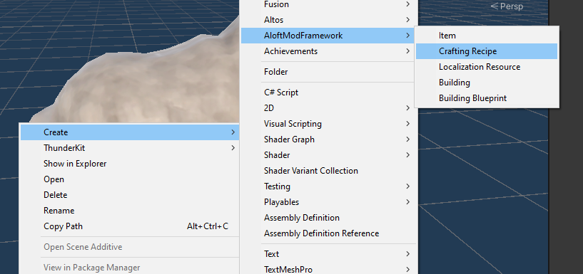
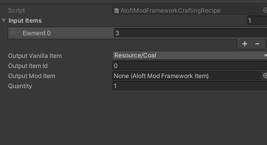

## Creating your first recipe

Our first recipe is going to be to turn Wood into Charcoal.

Right click in the asset browser and choose to create a new recipe.

Tweak the settings for the recipe to turn wood into coal:

To create this recipe, wire up `input items`, which is referencing `ItemIds`. `3` = Wood. For output choose one of the fields: `Output Vanilla Item`, `Output Item Id`, `Output Mod Item`. `Output Vanilla Item` is useful for quickly picking the item without having to research IDs. `Output Item Id` is great for hooking a new recipe into another content mods Items. `Output Mod Item` is great for referencing items created inside the same content bundle.

Launch the game and explore the new recipe!

