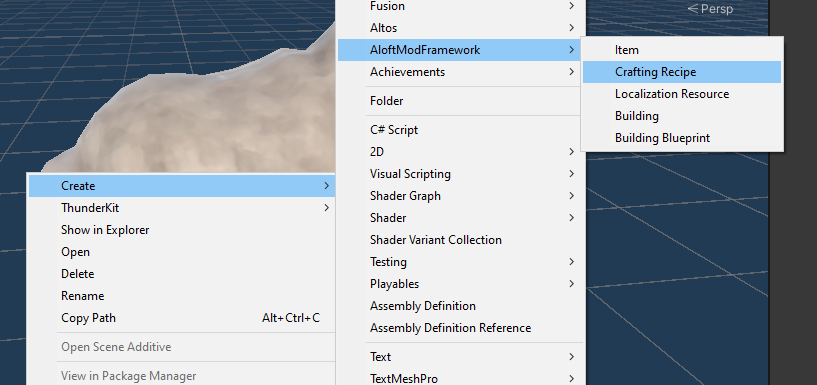
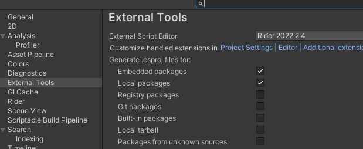
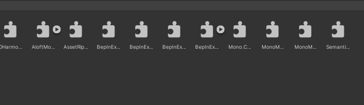
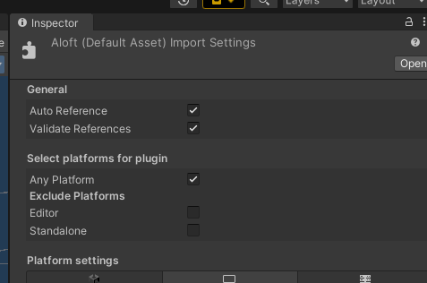

## Getting started with Aloft Mod Loader

These instructions will not include how to set up `Thunderkit`, but will contain set up instructions that might take place inside of thunderkit.

### For building content-only mods

A content-only mod is a mod that can be used to add new content to Aloft built upon existing behaviors. Examples to this that have been proven to work are adding new recipes, adding new structures and the corresponding building capabilities.

At this point when creating assets, Aloft Mod Framework related assets should appear in the creation menu.



See [creating your first recipe](CreatingARecipe.md) for an example of how to create your first recipe.

### For building content and code mods

A content and code mod comes into play after the boundaries of a content only mod end. With this style of mod, it becomes possible to build new behavior that does not currently exist in Aloft today (or to write behavior that is similar but not quite the same).

The BeeBoxes mod is an example of this. Beehives exist today in the game, but through some caveats of loading content and building the Prefab game object to represent the BeeBox, the existing functionality no longer worked correctly for the structure. As a result, a code only mod can be created to overcome to lacking functionality.

To have success in the workflow for creating a content and code mod, start by getting the integration to an external editor hooked up. Visual Studio 2019 should be supported out of the box (that is the version that is shipped with the Unity editor we need).



Add the `BepInEx` dll files to our project, part of the `code` aspect here requires a simple `BepInEx` plugin to load the `.dll` files that the `Assembly Definition` will generate.



Mark the `Aloft` assembly as auto reference and validate, this includes the Aloft files that need to be extended to make certain links work, while also enabling the use of statics like `Level`.



Now creating a C# file should allow opening of the external tool with the appropriate solution set up for coding. Adding a `BaseUnityPlugin` from `BepInEx` that looks like the following will make it so components added in the mod can be loaded by by the game objects at run time. Remember to change the parameters to align with the settings that make sense for the mod.

```
using BepInEx.Unity.Mono;
using BepInEx;

[BepInPlugin("a very unique string goes here", "a mod name goes here", "a version goes here")]
public class Plugin : BaseUnityPlugin
{
}
```

After this, building from the pipeline should generate `.dll` files for `BepInEx/Plugins` and asset bundles for `Aloft_Data/StreamingAssets/amf`. Placing them in the correct location should load them into the game using the Aloft Mod Framework.

### For developing and improving Aloft Mod Loader

To successfully develop and improve Aloft Mod Loader, one likely needs access to a tool like ILSpy or dnSpy. This will allow one to infer structure and requirements for hooking new aspects into Aloft. A tool like AssetRipper might be valuable to help with understanding and reversing how certain Prefabs work to understand how components fit together.

The general idea here is that `AloftModFramework` remains slim and provides an interface that makes sense for modding. It doesn't imply or provide any functionality. It replaces or extends resources provided by the game in ways that are more intuitive or more applicable for modding. One example of this is items. Aloft providers a great drop down for selecting an item, however it only includes existing in-game items. To make item selection still work for mods one can provide 3 properties instead. Selection by item id (as an int), selection by item id (as an enum), and selection by Item ScriptableObject reference. This permits selection from base game, selection from other mods, and selection from internal to an in development mod in ways that are practical for a project set up.

The goal of `AloftModLoader` is to permit those abstractions provided by the framework to actually work in game. During `Start` of the plugin (awake was avoided because all Monobehavior plugins need to be loaded BEFORE loading prefabs or else references break), the requisite ScriptableObjects are generated and attached to the game in the correct locations for them to work. As an example, the mod framework has an `AloftModFrameworkItem` that is then turned into a `ScriptableInventoryItem`. The big difference here is exposing the `ItemId` property to assign static item ids to an item to permit item ids outside of the typical in game items.
